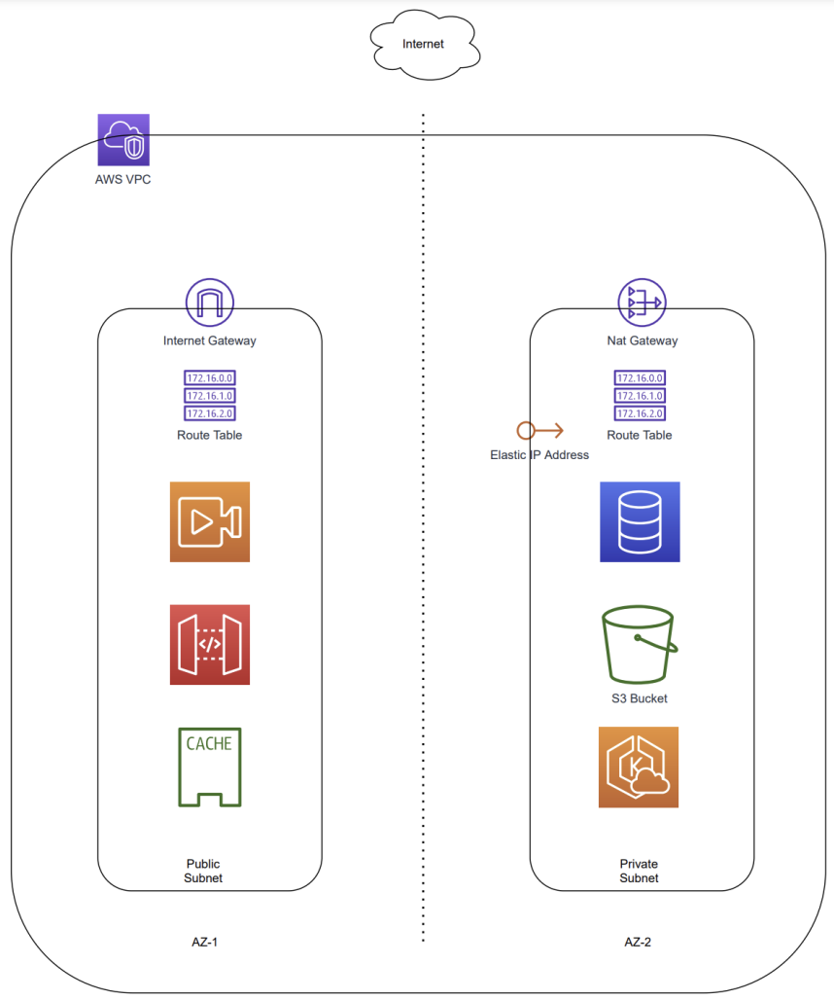

# CloudCore



**CloudCore**: Utilize Terraform for efficient AWS infrastructure deployment and rely on Ansible for detailed configurations. CloudCore provides a balanced blend of simplicity and precision for your cloud environment setup.

---

## Table of Contents
- [Features](#features)
- [Prerequisites](#prerequisites)
- [Installation](#installation)
- [Usage](#usage)
- [Contribution](#contribution)
- [License](#license)
- [Contact](#contact)

---

## Features

- **Terraform Provisioning**: Efficiently set up AWS resources including VPCs, subnets, and gateways.
- **Ansible Configuration**: Utilize Ansible playbooks to ensure consistent configurations across your infrastructure.
- **Modular Design**: Separate files for variables, providers, infrastructure creation, and configuration.
- **Security Centric**: Emphasize a secure cloud setup with public and private subnet configurations.

---

## Prerequisites

- Terraform v0.12 or newer
- Ansible 2.x or newer
- AWS CLI configured with appropriate credentials

---

## Installation

1. Clone the repo:
   ```bash
   git clone https://github.com/fr3m3n/cloud-core